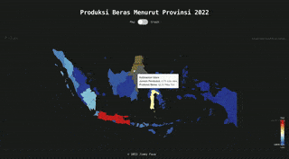

# Indonesia Rice Production and Population Visualization (2018-2022)

This repository hosts a Svelte-based web application for visualizing rice production in Indonesia from 2018 to 2022, alongside a visualization of the human population per province. It aims to provide insights into the agricultural trends and demographic distribution across the country.

### Features

- Interactive map visualizing rice production by province.
- Graphical representation of population data.
- Yearly breakdown of data from 2018 to 2022.
- Responsive design for accessibility across various devices.

## Data

### Data Source

The data used in this project is sourced from [Badan Pusat Statistik (BPS)](https://www.bps.go.id/), the official Statistics Bureau of Indonesia. BPS provides comprehensive datasets on various aspects of Indonesian life, including agricultural production and demographic information.

### Data Analysis

To analyze the data obtained from BPS, a Jupyter Notebook is used. This Notebook contains detailed steps and methodologies applied to process, clean, and visualize the data, providing valuable insights into trends over the years.

#### Exploring the Notebook:

- **Access the Notebook**: The analysis can be viewed and interacted with through a Jupyter Notebook hosted on [Google Colab](https://colab.research.google.com/). You can access the Notebook [here](https://colab.research.google.com/drive/1qcFMjnyewvfr8yYx6XPBZpMkCFAOSY0X?usp=sharing).
  
- **Notebook Features**: The Notebook includes:
  - Data Cleaning: Steps to clean and structure the raw data from BPS.
  - Data Transformation: Procedures to transform the data into a more analysis-friendly format.
  - Visualization: Using various libraries to create meaningful and interpretable visualizations.
  - Insights: Observations and conclusions drawn from the data analysis.

#### Collaborating on the Notebook:

If you're interested in contributing to the data analysis or have suggestions for improvement, you can:
- **Comment on the Notebook**: Google Colab allows you to add comments and suggestions.
- **Fork and Modify**: You can make a copy of the Notebook, modify it, and if you believe your changes are beneficial, request to merge them into the original Notebook.

For any questions or discussions related to the data analysis, feel free to open an issue in this repository or contact me directly (contact details in the Contact section).